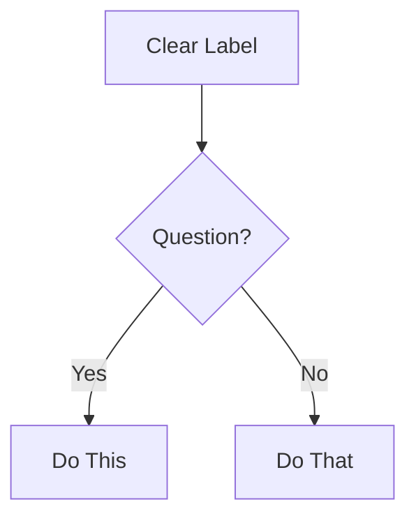

# Documentation Standards for Documentation-Tool-Generic

**Version:** 1.0.0  
**Last Updated:** 2025-11-20  
**Purpose:** Comprehensive documentation standards and guidelines for all project documentation

---

## Overview

This document defines the documentation standards for the Documentation-Tool-Generic project. These standards ensure consistency, quality, and maintainability across all documentation artifacts.

**Foundation Standards:**
- Based on BMAD Technical Documentation Standards (`.bmad/bmm/workflows/techdoc/documentation-standards.md`)
- CommonMark specification compliance
- Google Developer Documentation Style Guide principles
- Project-specific conventions

---

## CRITICAL RULES

### Rule 1: CommonMark Strict Compliance

ALL documentation MUST follow CommonMark specification exactly. No exceptions.

**CommonMark Essentials:**

**Headers:**
- Use ATX-style ONLY: `#` `##` `###` (NOT Setext underlines)
- Single space after `#`: `# Title` (NOT `#Title`)
- No trailing `#`: `# Title` (NOT `# Title #`)
- Hierarchical order: Don't skip levels (h1→h2→h3, not h1→h3)

**Code Blocks:**
- Use fenced blocks with language identifier:
  ````markdown
  ```python
  def example():
      return "code"
  ```
  ````
- NOT indented code blocks (ambiguous)

**Lists:**
- Consistent markers within list: all `-` or all `*` or all `+` (don't mix)
- Proper indentation for nested items (2 or 4 spaces, stay consistent)
- Blank line before/after list for clarity

**Links:**
- Inline: `[text](url)`
- Reference: `[text][ref]` then `[ref]: url` at bottom
- NO bare URLs without `<>` brackets
- Use relative paths for internal documentation links

**Emphasis:**
- Italic: `*text*` or `_text_`
- Bold: `**text**` or `__text__`
- Consistent style within document

**Line Breaks:**
- Two spaces at end of line + newline, OR
- Blank line between paragraphs
- NO single line breaks (they're ignored)

### Rule 2: NO TIME ESTIMATES

NEVER document time estimates, durations, or completion times for any workflow, task, or activity. This includes:

- Workflow execution time (e.g., "30-60 min", "2-8 hours")
- Task duration estimates
- Reading time estimates
- Implementation time ranges
- Any temporal measurements

Time varies dramatically based on:
- Project complexity
- Team experience
- Tooling and environment
- Context switching
- Unforeseen blockers

**Instead:** Focus on workflow steps, dependencies, and outputs. Let users determine their own timelines.

### Rule 3: Language and Tone

**Communication Language:** English (as per project configuration)

**Writing Style:**
- Active voice: "Click the button" NOT "The button should be clicked"
- Present tense: "The function returns" NOT "The function will return"
- Direct language: "Use X for Y" NOT "X can be used for Y"
- Second person: "You configure" NOT "Users configure" or "One configures"
- Task-oriented: Write for user GOALS, not feature lists
- Start with WHY, then HOW
- Every doc answers: "What can I accomplish?"

---

## Documentation Types and Standards

### User Documentation

#### User Manual (`USER_MANUAL.md`)

**Purpose:** Complete guide for end users of the application

**Required Sections:**
1. Introduction
   - What is the application
   - Key features overview
   - Use cases
2. Installation and Setup
   - System requirements
   - Installation steps
   - Configuration
   - Verification
3. Getting Started
   - First launch
   - Basic workflow
   - Quick examples
4. User Interface Overview
   - Main window components
   - Menu structure
   - Settings dialogs
5. Features and Functionality
   - Detailed feature descriptions
   - Step-by-step procedures
   - Configuration options
6. Configuration
   - Environment variables
   - Configuration files
   - Advanced settings
7. Best Practices
   - Preparation tips
   - Workflow recommendations
   - Quality guidelines
8. Troubleshooting
   - Common issues and solutions
   - Error messages
   - Log file locations
9. Advanced Features
   - Advanced workflows
   - Automation features
   - Integration options
10. Appendices
    - File structure
    - Supported formats
    - Keyboard shortcuts
    - Configuration reference

**Standards:**
- Comprehensive coverage of all features
- Step-by-step instructions with clear actions
- Screenshots or diagrams where helpful
- Examples for common use cases
- Clear error handling guidance

#### Quick Start Guide (`QUICKSTART.md`)

**Purpose:** Fast-track guide for new users

**Required Sections:**
1. Quick Installation
2. Basic Configuration
3. First Session
4. Example Workflow
5. Next Steps

**Standards:**
- Concise and focused
- Minimal setup required
- Working examples
- Links to detailed documentation

### Developer Documentation

#### README (`README.md`)

**Purpose:** Project overview and entry point

**Required Sections:**
1. Project Description
2. Features
3. Quick Start
4. Installation
5. Usage
6. Project Structure
7. Configuration
8. Contributing
9. License

**Standards:**
- Under 500 lines (link to detailed docs)
- Clear project overview
- Quick start instructions
- Links to comprehensive documentation

#### Architecture Documentation (`docs/architecture.md`)

**Purpose:** System design and architecture overview

**Required Sections:**
1. System Overview
   - High-level architecture diagram (Mermaid)
   - Component descriptions
   - Technology stack
2. Architecture Layers
   - GUI Layer
   - Business Logic Layer
   - Data Layer
   - Integration Layer
3. Component Descriptions
   - Module responsibilities
   - Interfaces
   - Dependencies
4. Data Flow
   - Process flows
   - Data structures
   - State management
5. Technology Decisions
   - ADRs (Architecture Decision Records)
   - Rationale for choices
6. Deployment Architecture
   - Runtime environment
   - Dependencies
   - Configuration

**Standards:**
- System overview diagram (Mermaid flowchart)
- Component descriptions with responsibilities
- Clear data flow documentation
- Technology decision rationale

#### Development Guide (`docs/development-guide.md`)

**Purpose:** Setup and development instructions

**Required Sections:**
1. Development Environment Setup
2. Code Organization
3. Development Workflow
4. Testing Approach
5. Code Style Guidelines
6. Contribution Guidelines
7. Build and Deployment

**Standards:**
- Complete setup instructions
- Code organization explanation
- Development workflow steps
- Testing guidelines
- Contribution process

#### API Documentation

**Purpose:** API reference for programmatic access

**Required Elements:**
- Module/class descriptions
- Function/method signatures
- Parameters with types
- Return values with types
- Usage examples
- Error handling
- Thread safety notes (if applicable)

**Standards:**
- Complete API coverage
- Type annotations
- Working examples
- Error documentation

### Technical Documentation

#### PRD (`docs/prd.md`)

**Purpose:** Product Requirements Document

**Required Sections:**
1. Executive Summary
2. Project Classification
3. Success Criteria
4. Product Scope
5. Functional Requirements
6. Non-Functional Requirements
7. Integration Requirements
8. Constraints and Assumptions
9. Risks and Mitigation
10. Success Metrics
11. Roadmap

**Standards:**
- Clear requirement statements
- Measurable success criteria
- Complete requirement coverage
- Risk identification

#### Technical Specifications

**Purpose:** Detailed technical specifications

**Standards:**
- Complete technical details
- Implementation guidance
- Interface specifications
- Data structure definitions

---

## Mermaid Diagrams: Standards

### Critical Rules

1. Always specify diagram type first line
2. Use valid Mermaid v10+ syntax
3. Test syntax before outputting (mental validation)
4. Keep focused: 5-10 nodes ideal, max 15

### Diagram Type Selection

- **flowchart** - Process flows, decision trees, workflows
- **sequenceDiagram** - API interactions, message flows, time-based processes
- **classDiagram** - Object models, class relationships, system structure
- **erDiagram** - Database schemas, entity relationships
- **stateDiagram-v2** - State machines, lifecycle stages
- **gitGraph** - Branch strategies, version control flows

### Formatting Example

````markdown

````

---

## File Organization Standards

### Directory Structure

```
Documentation-Tool-Generic/
├── README.md                    # Project overview
├── QUICKSTART.md                # Quick start guide
├── USER_MANUAL.md               # Complete user manual
├── CHANGELOG.md                 # Version history
├── LICENSE                      # License file
├── docs/                        # Comprehensive documentation
│   ├── index.md                 # Documentation index
│   ├── architecture.md          # Architecture documentation
│   ├── development-guide.md     # Developer guide
│   ├── prd.md                   # Product requirements
│   ├── DOCUMENTATION_STANDARDS.md  # This file
│   └── sprint-artifacts/        # Sprint documentation
└── .bmad/                       # BMAD framework docs
    └── bmm/
        └── workflows/
            └── techdoc/
                └── documentation-standards.md  # BMAD standards
```

### File Naming Conventions

- **User Documentation:** UPPERCASE with underscores (e.g., `USER_MANUAL.md`)
- **Developer Documentation:** lowercase with hyphens (e.g., `development-guide.md`)
- **Technical Documentation:** lowercase with hyphens (e.g., `architecture.md`)
- **Configuration Files:** lowercase with hyphens (e.g., `config-manager.py`)

### Cross-References

- Use relative paths for internal documentation links
- Format: `[Link Text](./relative/path/to/file.md)`
- Include section anchors when linking to specific sections: `[Link Text](./file.md#section-name)`

---

## Code Documentation Standards

### Inline Comments

**Purpose:** Explain WHY, not WHAT

**Standards:**
- Use comments for complex logic, not obvious code
- Explain business rules and constraints
- Document non-obvious behavior
- Keep comments up-to-date with code changes

**Example:**
```python
# Apply privacy mask before OCR to prevent sensitive data extraction
masked_image = privacy_mask.apply(screenshot)
```

### Docstrings

**Purpose:** API documentation for functions, classes, and modules

**Standards:**
- Use Google-style docstrings
- Include description, parameters, return values, exceptions
- Provide usage examples for complex functions

**Example:**
```python
def capture_screenshot(window_handle: int) -> PIL.Image:
    """Capture screenshot of specified window.
    
    Args:
        window_handle: Windows HWND handle of the window to capture
        
    Returns:
        PIL Image object containing the screenshot
        
    Raises:
        WindowNotFoundError: If window handle is invalid
        CaptureError: If screenshot capture fails
    """
```

### Type Hints

**Purpose:** Type information for better IDE support and documentation

**Standards:**
- Use type hints for all function parameters and return values
- Use `typing` module for complex types
- Document `None` returns explicitly

---

## Quality Checklist

Before finalizing ANY documentation:

- [ ] CommonMark compliant (no violations)
- [ ] NO time estimates anywhere (Critical Rule 2)
- [ ] Headers in proper hierarchy (h1→h2→h3)
- [ ] All code blocks have language tags
- [ ] Links work and have descriptive text
- [ ] Mermaid diagrams render correctly
- [ ] Active voice, present tense
- [ ] Task-oriented (answers "how do I...")
- [ ] Examples are concrete and working
- [ ] Accessibility standards met
- [ ] Spelling/grammar checked
- [ ] Reads clearly at target skill level
- [ ] Cross-references use relative paths
- [ ] File naming conventions followed
- [ ] Version and last-updated date included

---

## Documentation Maintenance

### Version Control

- All documentation is version-controlled in Git
- Use meaningful commit messages for documentation changes
- Review documentation changes in pull requests

### Update Process

1. **Identify Need:** User feedback, feature changes, bug fixes
2. **Update Documentation:** Follow standards and quality checklist
3. **Review:** Self-review against checklist
4. **Commit:** Meaningful commit message
5. **Verify:** Check rendering, links, examples

### Version Information

Include version information in documentation:

- Document version number
- Last updated date
- Author attribution (for major changes)

**Format:**
```markdown
**Version:** 1.0.0  
**Last Updated:** 2025-11-20  
**Author:** [Name or Team]
```

---

## Accessibility Standards

### Text

- Descriptive link text: "See the API reference" NOT "Click here"
- Clear headings that describe content
- Semantic heading hierarchy (don't skip levels)
- Tables have headers

### Visual Elements

- Alt text for diagrams: Describe what it shows
- Screenshots include context
- Color is not the only means of conveying information

### Structure

- Logical document flow
- Clear navigation
- Consistent formatting

---

## Project-Specific Conventions

### Terminology

**Consistent Terms:**
- "Session" (not "recording session" or "documentation session")
- "Step" (not "action step" or "documentation step")
- "Screenshot" (not "screen capture" or "image")
- "Prompt Profile" (not "AI profile" or "documentation style")

### Code Examples

**Language:** Python (primary language)

**Standards:**
- Use Python 3.10+ syntax
- Include necessary imports
- Show complete, working examples
- Include error handling where relevant

### Configuration Examples

**Format:** YAML for configuration files

**Standards:**
- Valid YAML syntax
- Comments for clarity
- Realistic examples
- Complete configurations

---

## Integration with BMAD Standards

This project follows BMAD Technical Documentation Standards (`.bmad/bmm/workflows/techdoc/documentation-standards.md`) as the foundation, with project-specific additions:

1. **BMAD Standards:** Base rules and conventions
2. **Project Standards:** This document (project-specific additions)
3. **Google Developer Docs:** Style guide defaults
4. **CommonMark Spec:** When in doubt

---

## Documentation Review Process

### Self-Review Checklist

Before submitting documentation:

1. Run through quality checklist
2. Verify all links work
3. Test code examples
4. Check Mermaid diagram syntax
5. Review for clarity and completeness
6. Verify no time estimates
7. Check CommonMark compliance

### Peer Review

- Documentation changes should be reviewed
- Focus on clarity, completeness, and accuracy
- Verify examples work as documented
- Check for consistency with existing docs

---

## Resources

### Internal Resources

- [BMAD Documentation Standards](.bmad/bmm/workflows/techdoc/documentation-standards.md)
- [Project Architecture](docs/architecture.md)
- [Development Guide](docs/development-guide.md)
- [User Manual](USER_MANUAL.md)

### External Resources

- [CommonMark Specification](https://commonmark.org/)
- [Google Developer Documentation Style Guide](https://developers.google.com/style)
- [Mermaid Diagram Documentation](https://mermaid.js.org/)
- [Markdown Guide](https://www.markdownguide.org/)

---

## Summary

These documentation standards ensure:

1. **Consistency:** All documentation follows the same standards
2. **Quality:** High-quality, maintainable documentation
3. **Accessibility:** Documentation accessible to all users
4. **Maintainability:** Easy to update and improve
5. **Completeness:** Comprehensive coverage of all topics

**Remember:** These standards are your foundation. Follow them consistently, and all documentation will be clear, accessible, and maintainable.

---

**Version:** 1.0.0  
**Last Updated:** 2025-11-20  
**Maintained By:** Product Management Team

